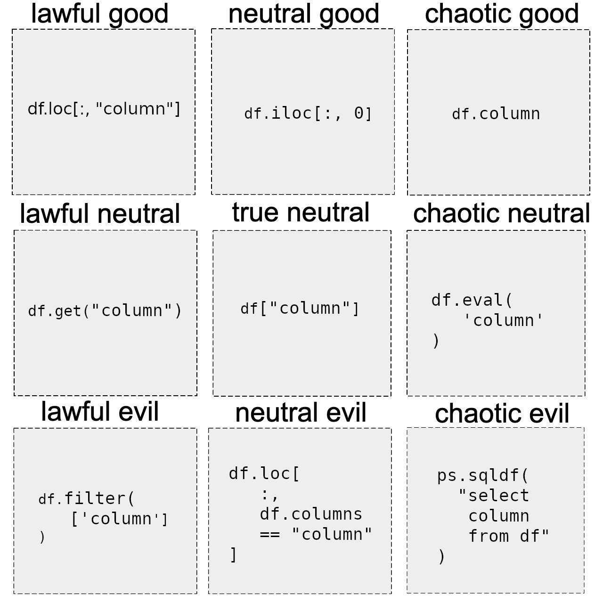

<h1 id="sparkypandy" align="center">
    SparkyPandy: a pandas API for spark
</h1>

<p align="center">
  <!-- TODO: https://bestpractices.coreinfrastructure.org/en -->
  <!-- TODO: https://www.gitpod.io/docs/getting-started -->
  <a href="https://pypi.org/project/sparkypandy/"></a>
  <a href="https://github.com/tpvasconcelos/sparkypandy/"></a>
  <a href="https://pypi.org/project/sparkypandy/"></a>
  <a href="https://github.com/tpvasconcelos/sparkypandy/blob/master/LICENSE"></a>
  <a href="https://github.com/psf/black"></a>
  <br>
  <a href="https://github.com/tpvasconcelos/sparkypandy/actions/workflows/ci.yaml/"></a>
  <a href="https://codecov.io/gh/tpvasconcelos/sparkypandy"></a>
  <a href="https://www.codefactor.io/repository/github/tpvasconcelos/sparkypandy"></a>
  <a href="https://www.codacy.com/gh/tpvasconcelos/sparkypandy/dashboard?utm_source=github.com&amp;utm_medium=referral&amp;utm_content=tpvasconcelos/sparkypandy&amp;utm_campaign=Badge_Grade"></a>
  <a href="https://requires.io/github/tpvasconcelos/sparkypandy/requirements/?branch=master"></a>
</p>

<p align="center"><i>It's not spark, it's not pandas, it's just awkward...</i></p>

<p align="center">
    <a href="https://www.youtube.com/watch?v=600hEP82eVo">
        
    </a>
</p>

---

## Where do I get it?


Get the binary installer for the latest available release at [PyPi](https://pypi.org/project/sparkypandy/)

```bash
pip install sparkypandy
```

or from [Conda](https://anaconda.org/conda-forge/sparkypandy)

```bash
conda install -c conda-forge sparkypandy
```

## But... y tho?

<details>
  <summary>We all love to hate on pandas' API... so why learn a new one?</summary>
  <br>
  
</details>
